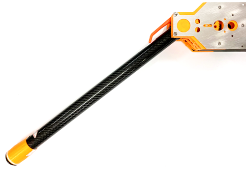

# A Multi-Modal, Selectively Lockable, Compact, Affordable Knee Joint Assembly for Bipedal Robots

Welcome to the repository for making your own knee joint concept demonstrator designed specifically for bipedal robots! The files provided here permit reproducing the knee joint as presented in International Conference on Intelligent Robots and Systems (IROS) 2024 conference (to be confirmed). A video demonstrating the performance of this knee assembly is available at https://youtu.be/-a_vLSxSMBE.

### Key functionalities:
*	Actuated bidirectional joint rotation
*	Disengaged (neutral) or active transmission modes
*	Backdrivable
*	Joint lockable when fully extended, and can remain locked without consuming any energy

## Mechanical hardware summary
To make things accessible for as many as possible, the design focuses heavily on field deposition modeling (FDM) 3D printable parts using a single extruder. Other items, like specialty parts, are described below. Fasteners are depicted in the CAD model. Mechanical and electronics assembly guidelines are provided separately. Refer [/CAD](CAD/).

### Manufactured parts
These mechanical parts do require workshop fabrication:
| Name (in CAD) | Description | Quantity | Details |
| ------------- | ----------- | -------- | ------- |
| KNEE_BRACE_3 | Chassis plate A | 2 | 1 mm SS304, laser cut |
| KNEE_BRACE_OUTER_V3 | Chassis plate B | 2 | 1 mm SS304, laser cut |
| KNEE_PIN_V3 | Knee lock pin bolt | 1 | SS304, CNC milled |
| KNEE_INNER_2B_V5 | Knee pivot | 1 | AL7050/7075, anodized, CNC milled |

### Bearings and bushings
| Name (in CAD) | Description | Quantity | Details |
| ------------- | ----------- | -------- | ------- |
| SKF - 61803 | Joint ball bearing | 2 | Can use 6803ZZ or alternatives |
| H370FI-0405-06 | Pin bolt sleeve | 1 | IGUS® bushing |
| H370SI-0405-06 | Pin bolt receptacle | 1 | IGUS® bushing installed in knee pivot |

### Actuators
| Name (in CAD) | Description | Quantity | Details |
| ------------- | ----------- | -------- | ------- |
| MOTOR_140 | Type 140 motor | 4 | Mabuchi RE-140RA-12240 or equivalent |
| SOLENOID_SH_K0730 | Latching solenoid | 1 | Shih Shin SH-K0730S-06V |

You will need to source a suitable spring (or two) for the latching solenoid. An example design is provided [here](CAD/SPRING.PDF).

## Electronics summary
Schematics and Gerber files to let you DIY electronics presented in the conference paper are provided in [/electronics](electronics/). The associated Python code (executable on a Raspberry Pi) are available in [/code](code/). Prescribed methods piggyback on 5V I2C communication protocol; remember to include a level shifter if using a Raspberry Pi. Shielded cabling mitigates EMI. However, you can use any method to operate the knee joint. Feel free to adapt and use your own devices if desired.

### Motor and solenoid driver (DRIVER_KNEE_V5)
Select your own feedback current resistor values (RFB) corresponding to R_M1 to R_M4 on the schematic. These should be populated – even if you do not intend to measure current. Nominal values provided are for reference only.

### Knee joint angle sensing (ENCODER)
A small radial magnet is necessary to complement this Hall-effect sensor. Adapt the CAD files as necessary for the magnet you acquire.

## Comments or suggestions
[Submit a ticket](https://github.com/Cheng-Yueh/knee/issues)

 
